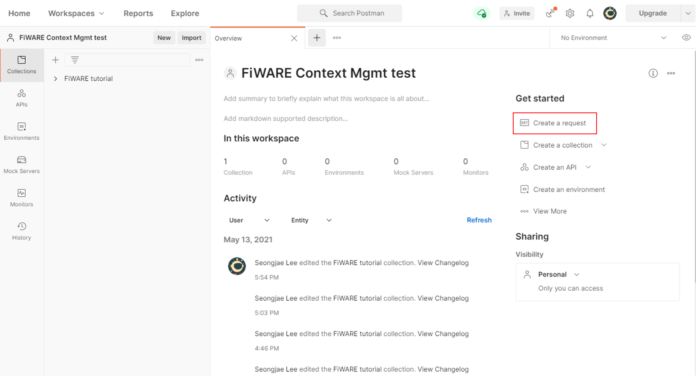
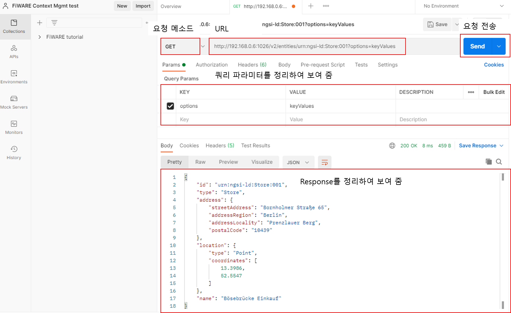
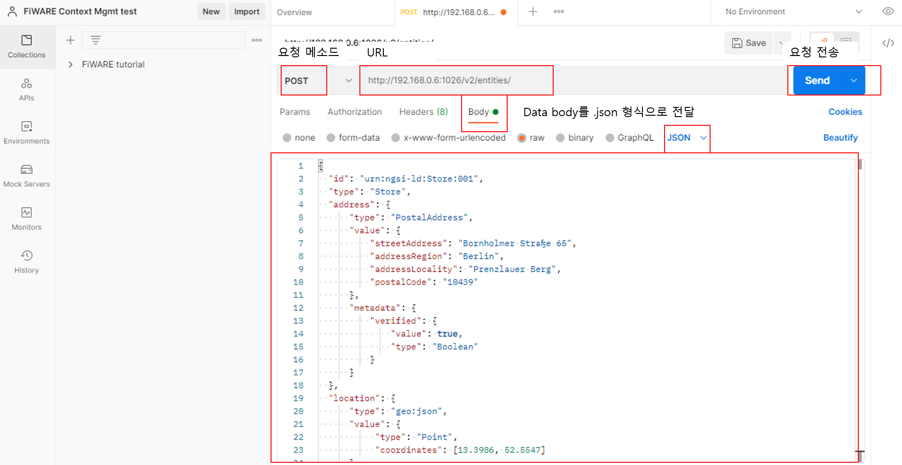

# FiWARE-Tutorial


- [FiWARE-Tutorial](#fiware-tutorial)
  - [배경 지식](#배경-지식)
    - [Docker](#docker)
      - [Docker image와 container](#docker-image와-container)
      - [Docker 조금 더 배워보기](#docker-조금-더-배워보기)
    - [RESTful API](#restful-api)
      - [Query string](#query-string)
      - [curl 명령어를 이용한 context broker와의 통신](#curl-명령어를-이용한-context-broker와의-통신)
      - [Postman을 이용한 context broker와의 통신 (선택 사항)](#postman을-이용한-context-broker와의-통신-선택-사항)
  - [사전 준비사항](#사전-준비사항)
    - [Docker 설치](#docker-설치)
    - [실습 환경 정보](#실습-환경-정보)
      - [docker 설치 (Ubuntu)](#docker-설치-ubuntu)
      - [Docker 설치 (Windows 10)](#docker-설치-windows-10)
    - [Orion context broker와 MongoDB 이미지 연결](#orion-context-broker와-mongodb-이미지-연결)
  - [Hello World!](#hello-world)
  - [Data entitiy 생성](#data-entitiy-생성)
  - [Data Entity 요청](#data-entity-요청)
    - [전체 data entitiy 요청](#전체-data-entitiy-요청)
    - [Data entitiy 쿼리](#data-entitiy-쿼리)
      - [특정 id를 가진 data entitiy 요청하기](#특정-id를-가진-data-entitiy-요청하기)
      - [options=와 attrs= 사용하기](#options와-attrs-사용하기)
      - [URL 주소로 특정 attribute 받아오기](#url-주소로-특정-attribute-받아오기)
      - [데이터 필터링](#데이터-필터링)
  - [Data entitiy 업데이트](#data-entitiy-업데이트)
    - [단일 attribute 변경](#단일-attribute-변경)
    - [다중 attribute 변경](#다중-attribute-변경)
  - [Data entitiy 삭제](#data-entitiy-삭제)
    - [Data entitiy의 attribute 삭제](#data-entitiy의-attribute-삭제)
    - [Data entity 삭제](#data-entity-삭제)


2021학년도 1학기 분산처리특강 FiWARE 설치 및 기본 사용법

작성자: 이성재

아래 참고 문서를 기반으로 만든 문서입니다.

* [Core Context Management: The NGSI-v2 Interface » Getting Started with NGSI-v2](https://fiware-tutorials.readthedocs.io/en/latest/getting-started/index.html#next-steps)
* [FIWARE NGSI APIv2 Walkthrough](https://fiware-orion.readthedocs.io/en/latest/user/walkthrough_apiv2/index.html#query-entity)
* [Wednesday Webinar: Core Context Management](https://www.youtube.com/watch?v=pK4GgYjlmdY)

## 배경 지식

FiWARE tutorial을 시작하기 전에, 예제 실행 및 FiWARE의 시스템 구조를 이해하는 데 필수적인 요소를 먼저 설명한다. 본 예제는 docker container를 통해 데이터베이스 MongoDB와 FiWARE Orion context broker를 사용하며, context broker와 client의 통신에 RESTful API를 사용하기 때문에 이 두 가지 사항에 대해 먼저 설명한다.

### Docker

Docker는 어플리케이션의 개발, 배포, 실행을 infrastructure 독립적으로 가능하게 해 주는 개방형 플랫폼이다. Docker는 다양한 프로그램, 실행환경을 컨테이너로 추상화하고, 동일한 인터페이스를 제공하여 프로그램의 배포 및 관리를 단순하게 해 준다.

FiWARE tutorial 문서는 docker image를 이용하여 필요한 구성 요소를 다운로드받은 후 예제 실습을 진행하기 때문에 docker에 대한 기본적인 이해가 필요하다. 

#### Docker image와 container

Container는 소프트웨어의 실행 환경을 독립적으로 유지할 수 있게 해 주는 운영체제 수준의 격리 기술을 의미한다. 즉 docker container는 대상 software의 실행에 필요한 의존성 요소를 모두 가지고 있는 격리된 환경이라고 볼 수 있다.

Image는 컨테이너 실행에 필요한 모든 리소스와 설정값들을 포함하고 있는 것으로 container를 image가 실행된 상태라고 볼 수 있다. Container의 상태가 바뀌어도 image는 변하지 않으며, 한 image에서 여러 가지 container를 실행할 수 있다.

#### Docker 조금 더 배워보기

* [생활코딩 docker 튜토리얼](https://www.youtube.com/watch?v=Bhzz9E3xuXY)
* [Docker 기본 사용법](http://pyrasis.com/Docker/Docker-HOWTO)

### RESTful API

RESTful (REpresentational State Transferful) API는 resource-based architecture의 한 종류로 아래 네 가지 특징을 가지고 있다.

1. Resource는 단일 naming scheme을 사용한다.
2. 모든 service는 동일한 인터페이스로 동작한다. 대표적으로 `PUT`, `GET`, `POST`, `DELETE`의 4가지 메소드를 이용하여 service를 제공한다.
3. 전달된 메시지는 'self-described'되어야 한다. 대표적으로 `.json`, `.xml` 포맷이 있다.
4. service를 수행하고 난 뒤에는 그에 대한 모든 요소를 'forget'한다. 즉, 모든 service는 stateless execution이다.

| 메소드 | <center>기능</center>                                   |
| :----: | :------------------------------------------------------ |
|  PUT   | Modify a resource by transferring a new state           |
|  POST  | Create a new resource                                   |
|  GET   | Retrieve the state of a resource in some representation |
| DELETE | Delete a resource                                       |

<br>

RESTful API는 HTTP URI를 통해 자원을 명시하고, HTTP method를 통해 해당 자원에 대한 operation을 한다. FiWARE에서는 client가 RESTful API를 이용하여 context broker에 메시지를 넘기고 필요한 data를 query하기 때문에 RESTful API에 대한 사용법을 알고 있어야 한다.

#### Query string

FiWARE에서는 쿼리 스트링을 이용하여 context broker에 파라미터를 넘긴다. 아래와 같은 방식으로 파라미터를 전달한다.

```
http://[host name]:[port]/[path of url]/[file]?[key1]=[value1]&[key2]=[value2]&...&[key n]=[value n]
```

= 연산자로 key와 value를 구분한다.

#### curl 명령어를 이용한 context broker와의 통신

curl은 서버와 클라이언트 간 data transfer 명령어이다. FTP, HTTP, POP3 등 여러 application protocol을 사용할 수 있다. FiWARE 예제에서는 curl 명령어를 이용하여 context broker와 통신을 수행한다.

FiWARE에서 사용하는 curl 명령어 예시는 아래와 같다.

```sh
$ curl --location --request POST 'orion context broker의 URI' \
--header 'Content-Type: application/json' \
--data-raw 'json 형식의 text data'
```

* `--location` 옵션: HTTP에서 요청한 페이지가 다른 location으로 옮겨졌을 때 새로운 location에 대해 자동으로 재요청한다.
* `--request` 옵션: HTTP 메소드를 지정한다. `PUT`, `GET`, `POST`, `DELETE` 등으로 지정할 수 있다.
* `--header` 옵션: HTTP 헤더를 추가하는 옵션. 본 실습에서는 json 파일 형식을 사용하기 때문에 `'Content-Type: application/json'` 헤더를 붙여 준다. 더 자세한 `Content-Type`에 관한 내용은 [링크](https://hbesthee.tistory.com/45)를 참조하면 좋다.
* `--data-raw` 옵션: `POST` request를 진행할 때 data를 raw data 형태로 전달한다. `@` 기호를 이용한 special character는 무시한다.

종합적으로 명령어를 해석하면 orion context broker의 URI에 json 타입의 데이터를 text 형태로 `POST` 한다라고 할 수 있다.

더 다양한 curl 사용법은 [curl 공식 documentation](https://curl.se/docs/manpage.html)을 참고하면 좋다.

#### Postman을 이용한 context broker와의 통신 (선택 사항)

Postman은 무료 REST API 테스트 프로그램이며, REST API 기반으로 통신하는 경우가 많은 FiWARE 실습에서 아주 유용하게 사용할 수 있다. Windows, Mac, Linux에서 모두 사용 가능하며 홈페이지에서 다운로드받을 수 있다. Ubuntu에서는 아래 명령어로 설치 가능하다.

```
$ sudo snap install postman
```

다른 운영체제에서는 [Postman 홈페이지](https://www.postman.com/downloads/)에서 다운로드받아 사용할 수 있다.

**간단한 사용법**

Postman을 실행하고 Workspaces에 들어가 새로운 workspace를 만든다.


Workspace에 들어간 후 create a request 를 클릭하여 request를 생성한다.



GET 메소드 사용 예제



POST 메소드 사용 예제



## 사전 준비사항

### Docker 설치

[Docker 홈페이지](https://docs.docker.com/engine/install/)의 설명에 기반하여 docker를 설치한다. 본 문서는 Ubuntu 18.04.5를 기준으로 진행하지만 docker에서 지원하는 운영체제를 가지고 있다면 그에 맞추어 설치해도 무방하다.

### 실습 환경 정보

* Ubuntu 18.04.5에서 진행하였다.
* Docker를 설치할 수 있는 환경이라면 플랫폼 독립적으로 실행 가능

#### docker 설치 (Ubuntu)

1) 구버전이 설치되어 있는 경우 아래 명령어로 제거한다.

```sh
$ sudo apt purge docker docker-engine docker.io docker-ce docker-ce-cli containerd.io runc
```

2) 아래 명령어를 통해 사전 준비사항을 설치한다.

```sh
$ sudo apt update

$ sudo apt-get install \
    apt-transport-https \
    ca-certificates \
    curl \
    gnupg \
    lsb-release
```

3) Docker의 공식 GPG key를 추가한다.

```sh
$ curl -fsSL https://download.docker.com/linux/ubuntu/gpg | sudo gpg --dearmor -o /usr/share/keyrings/docker-archive-keyring.gpg
```

4) Stable repository setup을 진행한다.

```sh
$ echo \
  "deb [arch=amd64 signed-by=/usr/share/keyrings/docker-archive-keyring.gpg] \
  https://download.docker.com/linux/ubuntu \
  $(lsb_release -cs) stable" | sudo tee /etc/apt/sources.list.d/docker.list > /dev/null
```

5) Docker engine을 설치한다.

```sh
$ sudo apt update
$ sudo apt install docker-ce docker-ce-cli containerd.io
```

6) 설치가 잘 되었는지 확인한다.

```sh
$ sudo docker run hello-world
```

아래와 같은 창이 출력되면 설치가 성공한 것이다.

```sh
Hello from Docker!
This message shows that your installation appears to be working correctly.

To generate this message, Docker took the following steps:
 1. The Docker client contacted the Docker daemon.
 2. The Docker daemon pulled the "hello-world" image from the Docker Hub.
    (amd64)
 3. The Docker daemon created a new container from that image which runs the
    executable that produces the output you are currently reading.
 4. The Docker daemon streamed that output to the Docker client, which sent it
    to your terminal.

To try something more ambitious, you can run an Ubuntu container with:
 $ docker run -it ubuntu bash

Share images, automate workflows, and more with a free Docker ID:
 https://hub.docker.com/

For more examples and ideas, visit:
 https://docs.docker.com/get-started/
```

#### Docker 설치 (Windows 10)

**WSL 설치**

[마이크로소프트 공식 페이지](https://docs.microsoft.com/en-us/windows/wsl/install-win10)에서 WSL (Windows Subsystem for Linux)를 설치한다. Ubuntu 운영체제를 설치하는 것을 추천한다.

```sh
> wsl --install
```

**Docker 다운로드 및 설치**

WSL을 성공적으로 설치한 후, [docker 공식 다운로드 매뉴얼](https://docs.docker.com/docker-for-windows/install/)을 참고하여 docker를 설치할 수 있다.

### Orion context broker와 MongoDB 이미지 연결

Orion context broker는 데이터 모델로 NGSI-V2를 사용하고 데이터베이스로 MongoDB를 사용한다. Docker를 이용하여 FiWARE 사용 환경을 구축하기 위해 `fiware/orion` 컨테이너와 `mongo:4.2` 컨테이너를 연결한다. network 명령어를 이용하여 두 컨테이너를 연결할 수 있다.

```sh
$ docker pull mongo:4.2
$ docker pull fiware/orion
$ docker network create fiware_default
```

아래 명령어를 이용하여 받아온 docker image, 설정한 docker network 정보를 확인할 수 있다.

```sh
$ docker images # docker image 목록 확인
$ docker network ls # docker network 목록 확인
$ docker network inspect fiware_default # fiware_default 정보 확인
```

아래 명령어로 MongoDB 컨테이너를 실행한다.

```sh
$ docker run -d --name=mongo-db --network=fiware-default \
    --expose=27017 mongo:4.2 --bind_ip_all
```

아래 명령어로 fiware-orion 컨테이너를 실행한다.

```sh
$ docker run -d --name fiware-orion -h orion --network=fiware_default \
    -p 1026:1026 fiware/orion -dbhost mongo-db
```

## Hello World!

컨테이너를 실행한 후 `docker ps` 명령어를 이용하여 실행되고 있는 컨테이너를 확인할 수 있다. 아래와 같이 두 개의 컨테이너가 실행되고 있음을 확인할 수 있다.

**Request**

```sh
$ docker ps
```

**Response**

```
CONTAINER ID   IMAGE          COMMAND                  CREATED          STATUS          PORTS                                       NAMES
3ea461f2e849   fiware/orion   "/usr/bin/contextBro…"   14 minutes ago   Up 14 minutes   0.0.0.0:1026->1026/tcp, :::1026->1026/tcp   fiware-orion
1d8c8bbb7847   mongo:4.2      "docker-entrypoint.s…"   16 minutes ago   Up 16 minutes   27017/tcp                                   mongo-db
```

컨테이너가 실행되고 있는 것을 확인한 상태에서, 아래 curl 명령어 또는 postman request로 Orion context manager의 버전 정보를 `GET` 메소드로 요청하여 정상 작동을 확인할 수 있다.

**Request**

```sh
$ curl --location --request GET 'http://localhost:1026/version'
```

**Response**

```json
{
"orion" : {
  "version" : "3.0.0-next",
  "uptime" : "0 d, 3 h, 26 m, 9 s",
  "git_hash" : "686c4f10cb647eab70a674cfaa88ca7977b53223",
  "compile_time" : "Wed May 12 13:30:11 UTC 2021",
  "compiled_by" : "root",
  "compiled_in" : "46c2c05dcde4",
  "release_date" : "Wed May 12 13:30:11 UTC 2021",
  "machine" : "x86_64",
  "doc" : "https://fiware-orion.rtfd.io/",
  "libversions": {
     "boost": "1_66",
     "libcurl": "libcurl/7.61.1 OpenSSL/1.1.1g zlib/1.2.11 nghttp2/1.33.0",
     "libmicrohttpd": "0.9.70",
     "openssl": "1.1",
     "rapidjson": "1.1.0",
     "mongoc": "1.17.4",
     "bson": "1.17.4"
  }
}
}
```

## Data entitiy 생성

RESTful API의 `POST` method를 이용하여 data entitiy를 만들어 본다. Orion context manager에 다음과 같은 상점 정보를 `.json` 형태로 생성할 것이다.

```json
// store_test1.json
{
  "id": "urn:ngsi-ld:Store:001",
  "type": "Store",
  "address": {
      "type": "PostalAddress",
      "value": {
          "streetAddress": "Bornholmer Straße 65",
          "addressRegion": "Berlin",
          "addressLocality": "Prenzlauer Berg",
          "postalCode": "10439"
      },
      "metadata": {
          "verified": {
              "value": true,
              "type": "Boolean"
          }
      }
  },
  "location": {
      "type": "geo:json",
      "value": {
           "type": "Point",
           "coordinates": [13.3986, 52.5547]
      }
  },
  "name": {
      "type": "Text",
      "value": "Bösebrücke Einkauf"
  }
}
```

이 `.json` 파일은 NGSIV2 data model을 따르고 있다. 모든 entitiy는 unique id를 가지고 있어야 한다. 각 Attribute는 `type`, `value` 쌍으로 구성되어 있다. 이 내용의 entitiy를 Postman request를 통해서 `POST`하거나 아래와 같은 curl 명령어를 이용하여 `POST`할 수 있다.

**Request**

```sh
$ curl --location --request POST 'http://localhost:1026/v2/entities' \
--header 'Content-Type: application/json' \
--data-raw '{
  "id": "urn:ngsi-ld:Store:001",
  "type": "Store",
  "address": {
      "type": "PostalAddress",
      "value": {
          "streetAddress": "Bornholmer Straße 65",
          "addressRegion": "Berlin",
          "addressLocality": "Prenzlauer Berg",
          "postalCode": "10439"
      },
      "metadata": {
          "verified": {
              "value": true,
              "type": "Boolean"
          }
      }
  },
  "location": {
      "type": "geo:json",
      "value": {
           "type": "Point",
           "coordinates": [13.3986, 52.5547]
      }
  },
  "name": {
      "type": "Text",
      "value": "Bösebrücke Einkauf"
  }
}'
```

Create가 성공하면 HTTP response로 201을 받는다. 똑같은 명령을 한 번 더 실행하면 id가 충돌하기 때문에 422 (unprocessable entitiy)를 받는다.

**Response (실패 시)**

```sh
# Error
{"error":"Unprocessable","description":"Already Exists"}
```

아래 json file을 다시 post하게 되면 id가 겹치지 않기 때문에 정상적으로 create된다.

```json
// store_test2.json
{
  "type": "Store",
  "id": "urn:ngsi-ld:Store:002",
  "address": {
      "type": "PostalAddress",
      "value": {
          "streetAddress": "Friedrichstraße 44",
          "addressRegion": "Berlin",
          "addressLocality": "Kreuzberg",
          "postalCode": "10969"
      },
      "metadata": {
          "verified": {
              "value": true,
              "type": "Boolean"
          }
      }
  },
  "location": {
      "type": "geo:json",
      "value": {
           "type": "Point",
           "coordinates": [13.3903, 52.5075]
      }
  },
  "name": {
      "type": "Text",
      "value": "Checkpoint Markt"
  }
}
```

## Data Entity 요청

### 전체 data entitiy 요청

`"id": "urn:ngsi-ld:Store:001"`, `"id": "urn:ngsi-ld:Store:002"`의 entitiy를 create한 상태에서 curl 명령어나 postman 프로그램으로 `GET` 메소드를 이용하여 Context manager에게 data entitiy를 요청하면 아래와 같이 모든 내용의 entitiy를 받게 된다.

**Request**

```sh
# curl 요청 명령어
$ curl --location --request GET 'http://localhost:1026/v2/entities'
```

**Response**

```json
[
    {
        "id": "urn:ngsi-ld:Store:001",
        "type": "Store",
        "address": {
            "type": "PostalAddress",
            "value": {
                "streetAddress": "Bornholmer Straße 65",
                "addressRegion": "Berlin",
                "addressLocality": "Prenzlauer Berg",
                "postalCode": "10439"
            },
            "metadata": {
                "verified": {
                    "type": "Boolean",
                    "value": true
                }
            }
        },
        "location": {
            "type": "geo:json",
            "value": {
                "type": "Point",
                "coordinates": [
                    13.3986,
                    52.5547
                ]
            },
            "metadata": {}
        },
        "name": {
            "type": "Text",
            "value": "Bösebrücke Einkauf",
            "metadata": {}
        }
    },
    {
        "id": "urn:ngsi-ld:Store:002",
        "type": "Store",
        "address": {
            "type": "PostalAddress",
            "value": {
                "streetAddress": "Friedrichstraße 44",
                "addressRegion": "Berlin",
                "addressLocality": "Kreuzberg",
                "postalCode": "10969"
            },
            "metadata": {
                "verified": {
                    "type": "Boolean",
                    "value": true
                }
            }
        },
        "location": {
            "type": "geo:json",
            "value": {
                "type": "Point",
                "coordinates": [
                    13.3903,
                    52.5075
                ]
            },
            "metadata": {}
        },
        "name": {
            "type": "Text",
            "value": "Checkpoint Markt",
            "metadata": {}
        }
    }
]
```

### Data entitiy 쿼리

#### 특정 id를 가진 data entitiy 요청하기

`"id": "urn:ngsi-ld:Store:001"` entitiy만 가지고 오고 싶으면 아래와 같은 명령어로 데이터를 쿼리할 수 있다.

**Request**

```sh
$ curl --location --request GET 'http://localhost:1026/v2/entities/urn:ngsi-ld:Store:001'
```

**Response**
```json
{
    "id": "urn:ngsi-ld:Store:001",
    "type": "Store",
    "address": {
        "type": "PostalAddress",
        "value": {
            "streetAddress": "Bornholmer Straße 65",
            "addressRegion": "Berlin",
            "addressLocality": "Prenzlauer Berg",
            "postalCode": "10439"
        },
        "metadata": {
            "verified": {
                "type": "Boolean",
                "value": true
            }
        }
    },
    "location": {
        "type": "geo:json",
        "value": {
            "type": "Point",
            "coordinates": [
                13.3986,
                52.5547
            ]
        },
        "metadata": {}
    },
    "name": {
        "type": "Text",
        "value": "Bösebrücke Einkauf",
        "metadata": {}
    }
}
```

#### options=와 attrs= 사용하기


`type`을 제외한 `key:value`쌍만 보고 싶으면 `options=keyValues`를 이용하여 간결하게 정보를 쿼리할 수 있다.

**Request**

```sh
$ curl --location --request GET 'http://localhost:1026/v2/entities/urn:ngsi-ld:Store:001?options=keyValues'
```

**Response**

```json
{
    "id": "urn:ngsi-ld:Store:001",
    "type": "Store",
    "address": {
        "streetAddress": "Bornholmer Straße 65",
        "addressRegion": "Berlin",
        "addressLocality": "Prenzlauer Berg",
        "postalCode": "10439"
    },
    "location": {
        "type": "Point",
        "coordinates": [
            13.3986,
            52.5547
        ]
    },
    "name": "Bösebrücke Einkauf"
}
```

이외에도 `value`만 쿼리하고 싶으면 `options=values`를 이용할 수 있다. 이 경우에는 `attrs=[attribute]`와 조합하여 특정 `key`의 `value`만 쿼리할 수 있다. 예를 들어 location만 쿼리하고 싶으면 아래와 같이 요청한다.

**Request**

```sh
$ curl --location --request GET 'http://localhost:1026/v2/entities/urn:ngsi-ld:Store:001?options=values&attrs=location'
```

**Response**

```json
[
    {
        "type": "Point",
        "coordinates": [
            13.3986,
            52.5547
        ]
    }
]
```

#### URL 주소로 특정 attribute 받아오기

또한 URL에 `/v2/entities/{id}/attrs/{attrsName}/value`와 같은 형식으로도 데이터를 요청할 수 있다. 예를 들어 바로 위 예제와 동일한 결과를 얻기 위해 아래와 같은 요청을 할 수도 있다.

```sh
$ curl --location --request GET 'http://localhost:1026/v2/entities/urn:ngsi-ld:Store:001/attrs/location/value'
```

#### 데이터 필터링

특정 `value`를 가지고 있는 data entitiy를 필터링하고 싶은 경우 `q=[key]==[value]`를 이용한다. 예를 들어 가게 이름이 'Checkpoint Markt'인 data entitiy (`"id": "urn:ngsi-ld:Store:001"`인 entitiy)의 전체 정보를 보고 싶은 경우 아래와 같이 요청한다. 웹 표준에서 `'`는 `%27`이고, 공백은 `%20`이다 ([참고](https://ghdwn0217.tistory.com/76)).

**Request**

```sh
$ curl --location --request GET 'http://localhost:1026/v2/entities/?q=name==%27Checkpoint%20Markt%27'
```

**Response**

```json
[
    {
        "id": "urn:ngsi-ld:Store:002",
        "type": "Store",
        "address": {
            "type": "PostalAddress",
            "value": {
                "streetAddress": "Friedrichstraße 44",
                "addressRegion": "Berlin",
                "addressLocality": "Kreuzberg",
                "postalCode": "10969"
            },
            "metadata": {
                "verified": {
                    "type": "Boolean",
                    "value": true
                }
            }
        },
        "location": {
            "type": "geo:json",
            "value": {
                "type": "Point",
                "coordinates": [
                    13.3903,
                    52.5075
                ]
            },
            "metadata": {}
        },
        "name": {
            "type": "Text",
            "value": "Checkpoint Markt",
            "metadata": {}
        }
    }
]
```

## Data entitiy 업데이트

### 단일 attribute 변경

`PUT` 메소드를 이용하여 특정 data entitiy를 변경할 수 있다. 변경 대상이 되는 attribute는 `http://[context broker 주소]:[port]/id/attrs/path/of/attribute`로 접근한다. 예를 들어 `urn:ngsi-ld:Store:001`의 `address` attribute의 `value`를 변경하는 경우 다음과 같은 명령어로 변경할 수 있다.

**Request**

```sh
$ curl --location --request PUT 'http://localhost:1026/v2/entities/urn:ngsi-ld:Store:001/attrs/address/value/' \
    --header 'Content-Type: application/json' \
    --data-raw '{
        "streetAddress": "Bornholmer Straße 65",
        "addressRegion": "Berlin",
        "addressLocality": "Prenzlauer Berg",
        "postalCode": "20439"
    }'
```

`GET` 메소드로 `urn:ngsi-ld:Store:001`을 확인해 보면 `postalCode`가 `20439`로 변경되었음을 확인할 수 있다.

**Request**

```sh
$ curl --location --request GET 'http://localhost:1026/v2/entities/urn:ngsi-ld:Store:001'
```

**Response**

```json
{
    "id": "urn:ngsi-ld:Store:001",
    "type": "Store",
    "address": {
        "type": "PostalAddress",
        "value": {
            "streetAddress": "Bornholmer Straße 65",
            "addressRegion": "Berlin",
            "addressLocality": "Prenzlauer Berg",
            "postalCode": "20439"
        },
        "metadata": {
            "verified": {
                "type": "Boolean",
                "value": true
            }
        }
    },
    "location": {
        "type": "geo:json",
        "value": {
            "type": "Point",
            "coordinates": [
                13.3986,
                52.5547
            ]
        },
        "metadata": {}
    },
    "name": {
        "type": "Text",
        "value": "Bösebrücke Einkauf",
        "metadata": {}
    }
}
```

### 다중 attribute 변경

`PATCH` 명령어를 이용하여 data entitiy의 여러 attribute를 한 번에 변경할 수 있다. 다음 명령어는 `urn:ngsi-ld:Store:001`의 `location`, `name` attribute를 동시에 변경하는 메소드이다.

**Request**

```sh
curl --location --request PATCH 'http://localhost:1026/v2/entities/urn:ngsi-ld:Store:001/attrs' \
--header 'Content-Type: application/json' \
--data-raw '{
    "location": {
      "type": "geo:json",
      "value": {
           "type": "Point",
           "coordinates": [14.3986, 53.5547]
      }
  },
  "name": {
      "type": "Text",
      "value": "Bösebrücke Purchasing"
  }
}'
```

`GET` 메소드로 `urn:ngsi-ld:Store:001`을 확인해 보면 `location`의 `coordinates`와 `name`의 `value` 가 변해 있음을 확인할 수 있다.

**Request**

```sh
$ curl --location --request GET 'http://localhost:1026/v2/entities/urn:ngsi-ld:Store:001'
```

**Response**

```json
{
    "id": "urn:ngsi-ld:Store:001",
    "type": "Store",
    "address": {
        "type": "PostalAddress",
        "value": {
            "streetAddress": "Bornholmer Straße 65",
            "addressRegion": "Berlin",
            "addressLocality": "Prenzlauer Berg",
            "postalCode": "20439"
        },
        "metadata": {
            "verified": {
                "type": "Boolean",
                "value": true
            }
        }
    },
    "location": {
        "type": "geo:json",
        "value": {
            "type": "Point",
            "coordinates": [
                14.3986,
                53.5547
            ]
        },
        "metadata": {}
    },
    "name": {
        "type": "Text",
        "value": "Bösebrücke Purchasing",
        "metadata": {}
    }
}
```

## Data entitiy 삭제

### Data entitiy의 attribute 삭제

`DELETE` 메소드를 이용하여 data entitiy의 일부 attribute를 삭제할 수 있다. `id`가 `urn:ngsi-ld:Store:001`인 data entity의 `location` attribute를 삭제하려면 다음과 같음 명령어를 사용한다.

**Request**

```sh
$ curl --location --request DELETE 'http://localhost:1026/v2/entities/urn:ngsi-ld:Store:001/attrs/location'
```

`GET` 명령어로 data entitiy를 확인해 보면 `location` attribute가 지워졌음을 확인할 수 있다.

**Request**

```sh
$ curl --location --request GET 'http://localhost:1026/v2/entities/urn:ngsi-ld:Store:001'
```

**Response**

```json
{
    "id": "urn:ngsi-ld:Store:001",
    "type": "Store",
    "address": {
        "type": "PostalAddress",
        "value": {
            "streetAddress": "Bornholmer Straße 65",
            "addressRegion": "Berlin",
            "addressLocality": "Prenzlauer Berg",
            "postalCode": "20439"
        },
        "metadata": {
            "verified": {
                "type": "Boolean",
                "value": true
            }
        }
    },
    "name": {
        "type": "Text",
        "value": "Bösebrücke Purchasing",
        "metadata": {}
    }
}
```

### Data entity 삭제

`DELETE` 메소드를 이용하여 data entitiy 전체를 삭제할 수 있다. `id`가 `urn:ngsi-ld:Store:001`인 data entitiy를 삭제하려면 다음과 같은 명령어를 사용한다.

**Request**

```sh
$ curl --location --request DELETE 'http://localhost:1026/v2/entities/urn:ngsi-ld:Store:001'
```
Data entitiy를 삭제한 뒤 `urn:ngsi-ld:Store:001` data entity를 요청하면 오류가 발생하는 것을 확인할 수 있다.

**Request**

```sh
$ curl --location --request GET 'http://localhost:1026/v2/entities/urn:ngsi-ld:Store:001'
```

**Response**

```sh
{"error":"NotFound","description":"The requested entity has not been found. Check type and id"}
```
